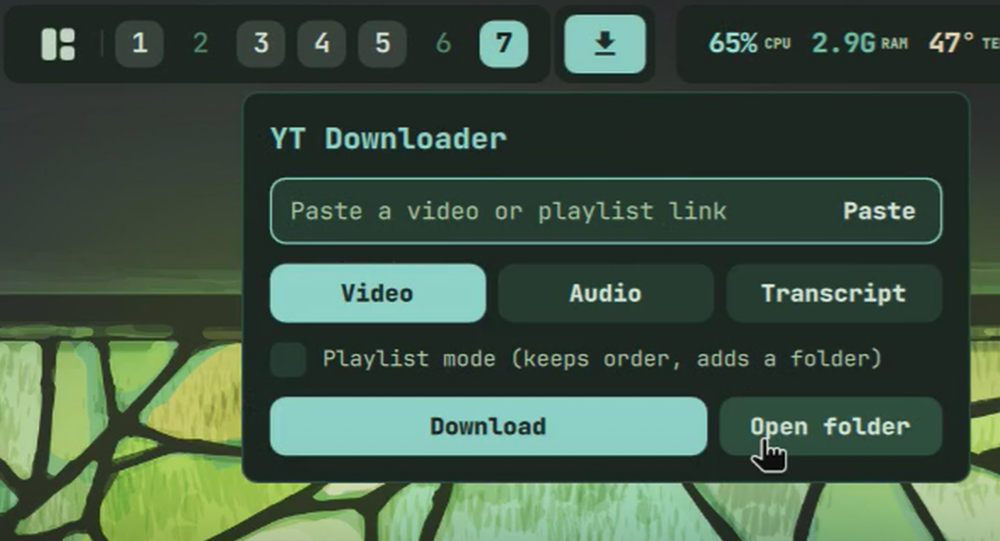
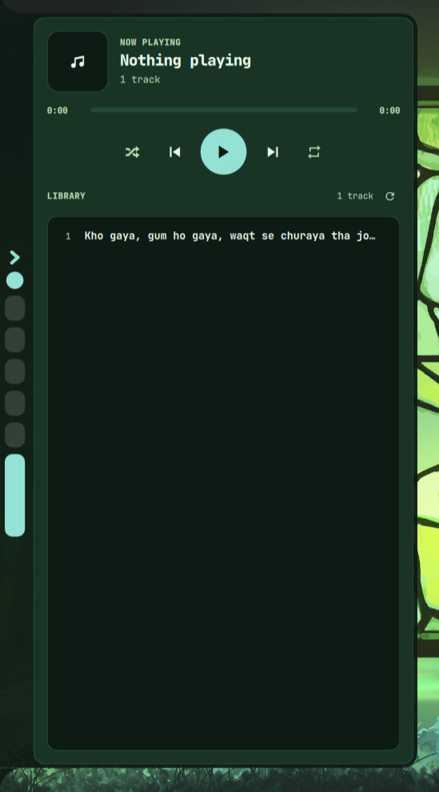
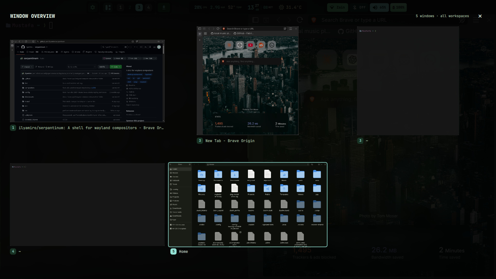
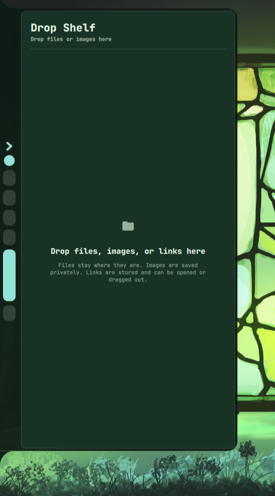
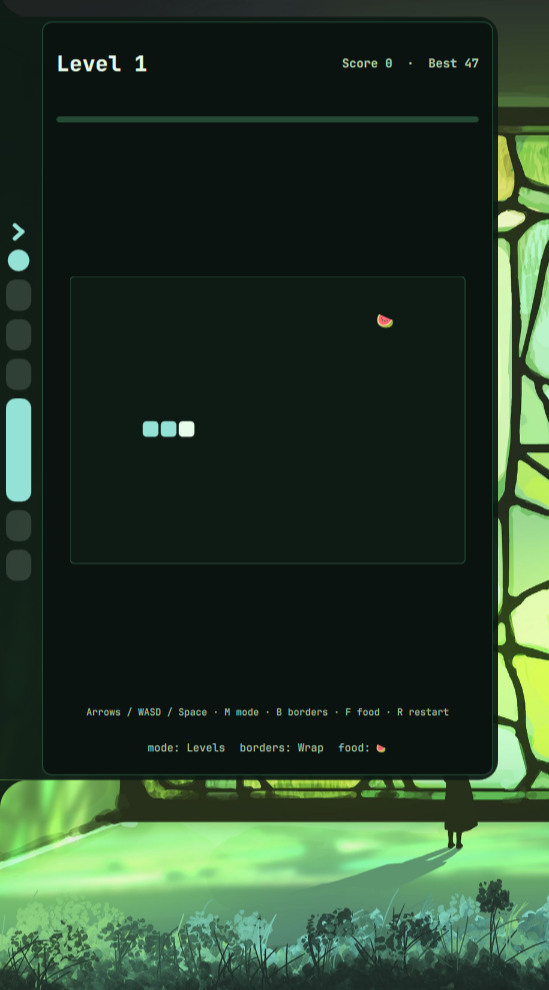

<div align="center">
  

  <h1>Serpantinum Plus</h1>
  <p>Serpantinum for Hyprland, plus a video downloader, music player, window overview, drop shelf and Snake.</p>

  <a href="LICENSE.md"></a>
  
  
  
</div>

## Install

**Already have Serpantinum?** This repository is for adding the custom modules to an existing install. The installer previews its changes, asks first, backs up files it overwrites, and restarts the shell when it can:

```bash
bash <(curl -fsSL https://raw.githubusercontent.com/Mustafa2624/serpantinum-plus/master/custom/install-addons.sh)
```

**Update:** after an official Serpantinum update, rerun this script to add the custom modules again.

<details>
<summary>Prefer to read the script first?</summary>

```bash
git clone --depth 1 https://github.com/Mustafa2624/serpantinum-plus.git
cd serpantinum-plus
bash custom/install-addons.sh --dry-run   # preview, changes nothing
bash custom/install-addons.sh             # install
```

</details>

## What's inside

### In the bar

<table>
  <tr>
    <td align="center"><br><b>Video downloader</b><br><sub>Video, audio, playlists and transcripts via yt-dlp</sub></td>
    <td align="center"><br><b>Music player</b><br><sub>Local library, seekbar, shuffle, repeat</sub></td>
    <td align="center"><br><b>Expose overview</b><br><sub>All windows from every workspace, macOS style</sub></td>
  </tr>
</table>

### In Quickactions

<table>
  <tr>
    <td align="center"><br><b>Music player</b><br><sub>Also available from Quickactions</sub></td>
    <td align="center"><br><b>Drop shelf</b><br><sub>Hold files and links, drag them out when needed</sub></td>
    <td align="center"><br><b>Snake</b><br><sub>A quick game in the Quickactions switcher</sub></td>
  </tr>
</table>

## Setup

Start the shell with `serpantinumd start`. Needs Arch Linux (or similar), Hyprland and Quickshell.

<details>
<summary>Autostart lines for clipboard and equalizer</summary>

```lua
hl.on("hyprland.start", function()
  hl.exec_cmd("wl-paste --type text --watch cliphist store")
  hl.exec_cmd("wl-paste --type image --watch cliphist store")
  hl.exec_cmd("systemctl --user enable --now easyeffects")
end)
```

</details>

<details>
<summary>Something not working?</summary>

- **Downloader error:** install `yt-dlp` and `ffmpeg`, then restart the shell.
- **No music playback:** install `mpv`, then restart the shell.
- **Clipboard or equalizer missing:** add the autostart lines above.
- **Patch conflict:** the installer lists the file that conflicts and stops before changing anything. Update Serpantinum or review the conflicting file before retrying.

</details>

## Credits and license

Based on [Serpantinum by ilyamiro](https://github.com/ilyamiro/serpantinum). Snake is inspired by [omarchy-snake-plugin](https://github.com/jhgundersen/omarchy-snake-plugin), the downloader by [omarchy-yt-downloader](https://github.com/dlpwaters/omarchy-yt-downloader). Thanks to Darkall44/Qylock for the material SDDM theme.

[](https://ko-fi.com/ilyamiro)

AGPL-3.0-or-later, see [LICENSE.md](LICENSE.md). Third-party notices: [`custom/THIRD_PARTY_NOTICES.md`](custom/THIRD_PARTY_NOTICES.md).

Copyright (C) 2026 Illia Miroshnichenko. Modified by Mustafa2624, 2026.

<details>
<summary>Upstream contributors</summary>

<div align="center">
  <a href="https://github.com/TheRinder2"></a>
  <a href="https://github.com/bizneskind-droid"></a>
  <a href="https://github.com/Pigeon78"></a>
  <a href="https://github.com/Eduarduar"></a>
  <a href="https://github.com/Spinty-dev"></a>
  <a href="https://github.com/MrDexstor"></a>
  <a href="https://github.com/coloramamoe"></a>
  <a href="https://github.com/Zyxilon"></a>
  <a href="https://github.com/gouthamkrishnap"></a>
  <a href="https://github.com/Stoltembergg"></a>
  <a href="https://github.com/andckadir"></a>
  <a href="https://github.com/ArseniiTkachuk"></a>
  <a href="https://github.com/MCUxDaredevil"></a>
  <a href="https://github.com/MILKv2"></a>
  <a href="https://github.com/pedrolourencosilva"></a>
  <a href="https://github.com/Vaspyyy"></a>
  <a href="https://github.com/Sergi122"></a>
  <a href="https://github.com/Syrup5845"></a>
  <a href="https://github.com/forteleaf"></a>
  <a href="https://github.com/kranks-uga"></a>
  <a href="https://github.com/zynx-real"></a>
</div>

</details>
